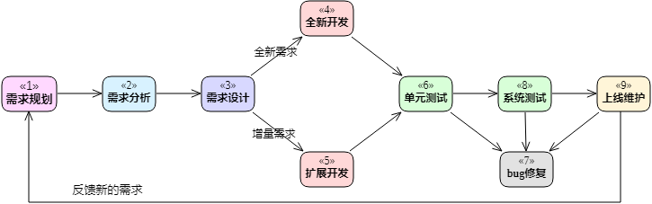

## 明辨是`非`

    

    
<i>来源：<a href="https://www.osnews.com/story/19266/wtfsm/">https://www.osnews.com/</a> (本人无意侵犯版权，如有侵权，请联系删除)</i>

看得清事情的本质，辩得了个中的曲折，我们以时间为线，品一品程序中的是是`非非`。

上图为典型的软件开发流程，`苦哈哈`就带领大家一起挖一挖这里面主要的`非非`。

## 需求分析的`非非`

- 需求理解偏差
- 场景遗漏

## 需求设计的`非非`

- 方案欠佳
- 设计形式主义
- 抽象不到位
- 数据结构欠佳
- 耦合中
- 无DFX设计
- 忽略程序性能
- 过度设计
- 过分乐观
- 无文档
- 文档不共享

## 开发的`非非`

- 代码编写的非非
  - 命名不当
  - 低级拼写错误
  - 复制粘贴错误
  - 低效的实现
  - 注释不当
- 一刀切的军规
- 代码提交的非非
  - commit信息随意
  - 代码不上库
  - 提交过多代码
- 重构的非非
  - 代码腐化不重构
  - 不想/敢重构

- 抽象和封装不够

## UT&ST的`非非`

- 无UT/ST
- 不重视UT/ST
- 场景遗漏
- 后补UT
- 片面相信覆盖率
- UT/ST代码随意
- 侵入源码做适配
- 实现成本过高
- 换人写UT
- 未发现问题

## 尾声

    

    
<i>来源：<a href="https://www.usglassmag.com/2017/04/a-new-take-on-the-broken-windows-theory/">https://www.usglassmag.com/</a> (本人无意侵犯版权，如有侵权，请联系删除)</i>

- 程序在其生命周期的`任何阶段`都可能引入问题

- `越早`的环节引入的问题，修复的`成本越高`

- 破窗效应：不要忽视和放任任何微小的`非非`

  